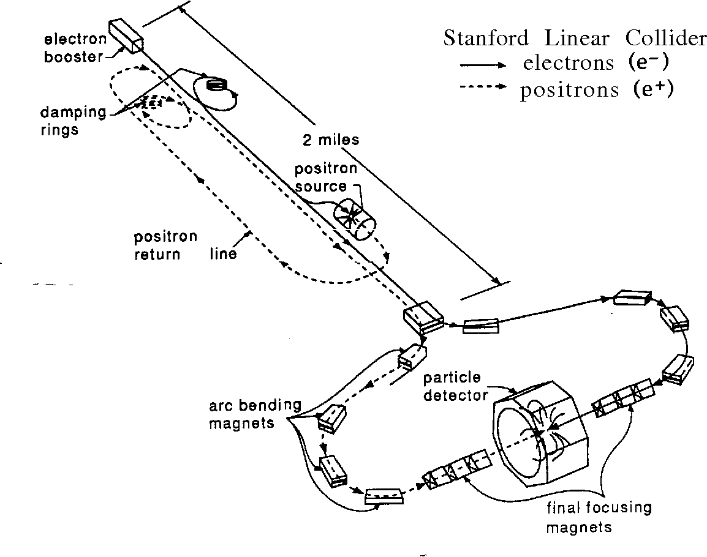
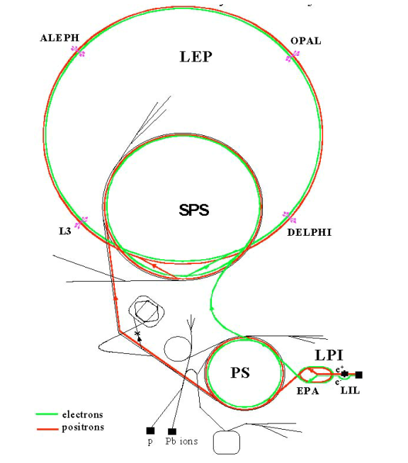

(sec_accelerators)=
# Part 2a: Particle accelerators

## Accelerators

### Ingredients of Scattering experiments: Collisions

All early scattering experiments used a radioactive elements (e.g. Radium) to provide $\alpha$ or $\beta$ particles with energies typically in the range of 4 to 8 MeV. 

In 1927 Rutherford addressed the Royal Society, describing what could be achieved with higher energy beams of particles: *"... if it were possible in the laboratory to have a supply of electrons and atoms of matter in general, of which the individual energy of motion is greater even than that of the alfa particle, [...] this would open up an extraordinary new field of investigation..."*

But bright sources with such energies were not yet available: man-made devices, mainly built as earlier seen, to produce X-rays, operated at the time at a lower range. However, as we have seen in the previous part, the energy of a particle determines how far it can probe into the structure of materie. 

In 1932 John Cockcroft and Ernest Walton build a new type of accelerator that allowed to accelerate protons to energies of several hundred keV {--} enough to split a lithium atom. Further advances in technology enabled the development of much more powerful accelerators, generally using electric fields that have the opposite charge to the particle beam such that the fields produce an attractive force and the beam particles are accelerated. Generally, the acceleration of particles beyond whatever velocity they already have e.g. from being produced in a decay is readily achieved using electrical fields, therefore mostly *charged* particles are used for scattering experiments in particle physics[^1]. 
[^1]: For the very few applications (mostly in material science) for which neutrons are used acceleration is achieved using magentic fields.

Based on these advances, larger and larger accelerators were developed in order to achieve higher energies. In the course of these improvements also the concept of scattering experiments had to be reassessed.


```{admonition} Calculation

Energy available in collisions

The geometrical setup of the experiments plays an important role as can be easily shown: Consider a perfectly *inelastic* collision of two identical object[^2]. Let's calculate the energy of the collisions for the fixed target and the head-on case.
[^2]: A perfectly inelastic collision occurs when the maximum amount of kinetic energy of a system is lost. In a perfectly inelastic collision, the colliding particles stick together. In such a collision, kinetic energy is lost by bonding the two bodies together. This can be shown analytically but this exceeds the scope of this course.  

* **Fixed target**

  This is the setup of the Rutherford experiment - an $\alpha$ particle impacting a gold foil or one object with speed $v$ colliding against a stationary target.

  For simplicity we consider two equal masses. The total kinetic energy before the collision is that of the moving object, namely $\frac{1}{2} m v^2$. After the collision both objects stick together, so the mass after the collision is ($2m$) and they move with the same velocity which is $v/2$ (conservation of momentum).

  The total kinetic energy after the collision is therefore: $\frac{1}{2} (2m) (v/2)^2 = \frac{1}{4} mv^2$
Energy transferred to the bodies is then E$^\textrm{before}$ - E$^\textrm{after}$: $\frac{1}{4} mv^2$, that is 50% of the initial energy.

- **Head-on collision**

  This is the setup of most modern colliders: Two particle with exact equal velocities but opposite directions collide head-on. They again have the same mass. The total kinetic energy before the collision is $2\times \frac{1}{2} mv^2 = mv^2$.
  Due to conservation of momentum, the velocity after the collision is zero as is the kinetic energy. The energy transferred to the bodies is therefore $mv^2$ that is 100% of the initial energy.

Head-on collisions are therefore more efficient in the conversion of kinetic energy into collision energy that can be used to change the internal state of the system (e.g. create excited states or new particles). 

```

### Geometry of accelerators

There are more considerations that play a role: In Rutherford's experiment there is a cnostant stream of particles passing the gold foil. Those that are *not* scattered pass through the target and - vanish. The same happens to larger energy colliders that are build in a linear arrangement such as the SLAC collider (left figure). This electron-proton collider has a linear acceleration before both particles are collided in a detection device. The particles not colliding with particles from the other beam are lost and new particles need to be produced and accelerated for the beam.

Circular colliders are more economical. Here (Figure right) particle beam are kept on a circular path and when the beams pass each they are kept onto the circular path and go into anouther round where they might collide. This means, the same particle keep in circulating in the ring, often for hours or days and less energy needs to be expanded to produce and accelerate the beams.

 

Two types of colliders: A lineary collider at SLAC, Berkeley and the LHC's predecessor the circular collider LEP at CERN, Geneva. (Pictures taken from {cite}`Shiltsev:2713605`)

However, keeping the particles on that beneficial circular path comes with its own challenges but these can be solved using a fundamental physical principle: The Lorentz-Force 

:::{admonition} Equation
:class: Warning

<b>Charged particle in a magnetic field</b>

A charge particle in a magnetic field is subject to the Lorentz-Force:

$$ F = q \vec{v} \times \vec{B} $$

where $q$ is the charge of the particle and $\vec{v} \times \vec{B}$ is the cross-product of the particles velocity and the magnetic field $B$. Strictly speaking the size of the force therefore depends on the angle between the velocity and the magnetic field, but as we want to achieve maximum deflection through the force and have full control over the geometry, we will only ever need to use:  

$$ F = q v B $$

So in this case, when the $B$ field is perpendicular to $v$, it causes the particle to move with a circular motion. The movement of a body on a circular path can generally be described with the centripetal force $F=m \frac{v^2}{R}$ which describes the acceleration of a particle on a circular path (times its mass to get the force). The Lorentz-Force needs to be equal to the centripetal force as they are both just different ways to describe the motion of the particle[^3]:
[^3]: see for the balance of forces here: https://sheffield-mps.github.io/Mechanics/Lecture3.html

$$ q v B = m \frac{v^2}{R} $$

We can solve for the radius of the curvature which is expressed as function of the momentum, the charge q and the field $B$:

$$R = \frac{m v}{q B} $$

Note: This is a "classical" treatment as we are using velocity $v$. Provided $p = mv$ is used this is correct also when $v$ approaches the speed of light, i.e. when you would normally need to use special relativity.
:::

The Large Hadron Collider (LHC) is currently the highest energy collider on earth. It accelerates two beams of protons to an energy of E=7 TeV and colliders them in four interaction points. The LHC has a circumference of 27 km. The protons are keep on the circular path by dipole magnets. There are two beam pipes for the protons - one for those travelling clockwise, the other for those travelling counter-clockwise. However these beam pipes are kept in the same housing and also use the same dipole magnet which is constructed to deliver the right magnetic field in the right place to keep both circulating beams of protons in the right place. A dipole magnet is the simplest type of magnet. It has two poles, one north and one south. The dipole magnets used in particles accelerators are electromagnets with a homogenous magnetic field across the path of the particles.

:::{admonition} Example
:class: tip
<b>Example: Calculation of the strength of the dipole magnets used at the LHC</b>

What's the B Field of the dipole magnets used at the LHC? We have:
- Beam energy E=7 TeV
- R = 27 km = 27 000 m

Now let's use the relationship from above:

$$
\begin{align*}
R &= \frac{m v}{q B} \\
&= \frac{p}{q B}\\
\Rightarrow B &= \frac{p}{q R}
\end{align*}
$$

We know that $E = pc$ thus $E/c = p$. Let's insert this:

\begin{align*}
B &= \frac{7 \times 10^{12} \mathrm{eV}}{3 \times 10^{8} \mathrm{m/s }\times 1.6 \times 10^{-19} \mathrm{C} \times 27 000\,\, \mathrm{m}} \\

&= \frac{7 \times 10^{12} \times \cancel{1.6 \times 10^{-19}} \,\,\mathrm{J}}{3 \times 10^{8} \mathrm{m/s} \cancel{\times 1.6 \times 10^{-19}}\,\,\mathrm{C} \times 27 000\,\, \mathrm{m}}\\
&= \frac{7 \times 10^{12} \mathrm{kg \,\, m}^2\mathrm{/s}^2}{3 \times 10^{8} \mathrm{m/s}\,\, \mathrm{ A s} \times 27 000 \,\,\mathrm{m}}\\

&= \frac{7 \times 10^{12} \mathrm{kg}\,\, \cancel{\mathrm{m}^2\mathrm{/s}} \,\, \mathrm{1/s}}{3 \times 10^{8} \cancel{\mathrm{m/s}} \,\, \mathrm{A s} \times 27 000\,\ \cancel{\mathrm{m}}}\\
& = 5.3 \frac{\mathrm{kg}}{\mathrm{A s}^2} = 5.3 \mathrm{T}\\
\end{align*}

where we have used the following relationship between the units [C (Coulomb)] = [A (Amp$\`{e}$re) s (second)] and [T (Tesla)]=[$\frac{\mathrm{kg}}{\mathrm{A s}}^2$]

:::

### Parts of Accelerators

In the example above, we have calculate a magnetic field of $B$=5.3 T. This would require the whole ring to be lined seemlessly with dipole magnets. However, we are also needing to place other components along the beam line - not to least mention the detectors themselves that are integrated into the ring. Therefore, whilst the 1232 dipoles make up a large part of the ring, they are not seemlessly lining the whole 27 km and need to have a stronger magnetic field to make up for it. The actual magnetic field at the LHC is $B$=8.33 T.

But what are these additional components needed in a circular collider ring?


Typical compontent of a circular accelerator. (Picture taken from {cite}`https://doi.org/10.5170/cern-2016-002`)

As shown on the figure the typical compontent of a circular accelerator are:

* **Dipole or bending magnets (here: Deflecting magnets)**: These bend the particle trajectories onto a circular path and keep them in a stable orbit around the ring.

* **Focusing magnets**: More complicated magnet configurations (such as quadrupole or multipole magnets) can focus the particle beams - they act like an optical lense does on light.

* **Injectionmagnets**: Used to give the beams a kick when they are inserted into the circular ring (usually there is a pre-acceleration stage that is linear or a circular ring with a lower energy)

* **Extractionmagnets**: If the beams become unstable, they are kicked out of the ring, usually onto a large block of concrete, a so-called "beam dump"

* **RF Cavities or accelerating components**: The accelerate the beams.


### Luminosity

We have seen in the first part of the chapter, that the cross-section in a fixed-target experiment depends on the proportion of particles being scattering out of all incoming particles and all target particles. Simply put:

:::{admonition} Equation
:class: Warning
<b>Cross-section in fixed target scattering experiments</b>

$$
R = J \sigma N\\
$$

Here, $R$ is the rate, i.e. the number of particles being scattered (also called $\Delta J$ before), $J$ is the flux, i.e. the number, of incoming particles (sometimes also called $\Phi$), $\sigma$ is the cross-section, i.e. the probability for the scatter to happen and $N$ is the number of target particles (which can be calculated using Avogadro's number and the general mass of the target though we will not use it in this course). The rate is usually calculated in second as is the flux but it can also be quoted as the total rate and flux in a given period of time.
:::

For collider experiments, the $J$ and $N$ are combined to give a measure for the number of potentially scattering or interacting particles passing each other. This measure is called the **Luminosity** of a collider and represented to some extend the *total amount of potential scatterings*. Again this is usually given in seconds, but can also be integrated to give the luminosity in a given period of time, e.g. a year of data taking.

:::{admonition} Equation
:class: Warning
<b>Cross-section in collider experiments</b>

$$
N = \sigma L \\
$$

Here, $N$ is the rate of scattering events, i.e. the number of particles being scattered, $\sigma$ is the cross-section, i.e. the probability for the scatter to happen and $L$ is the Luminosity, giving the total available dataset on which scatterings can happen.
:::

The luminosity is a characteristic of the particle beams circulating in the collider and therefore essentially a characteristic of the collider itself. Similar to the flux in fixed target experiments, it essentially is calcuated from the total number of particles passing each other, however here also taking into account that the beams do not have a uniform area. It is defined as:

$$
L = \frac{N_1 N_2 f N_b}{4 \pi \sigma_x \sigma_y}
$$

$N_1$ and $N_2$ are the number of particles in the two colliding
bunches, $f$ is the revolution frequency and $N_b$ is the number
of bunches in one beam (each particle beam consists of packets of beam particles, there is no continuous beam in modern colliders due to how the acceleration is implemented). This formula practically considers one bunch travelling along the collider ring, passing all the bunches in the other beam. $4 \pi \sigma_x \sigma_y$ is a normalisation parameter that accounts for the fact that the beams are have a Gaussian profile and are not uniform.

