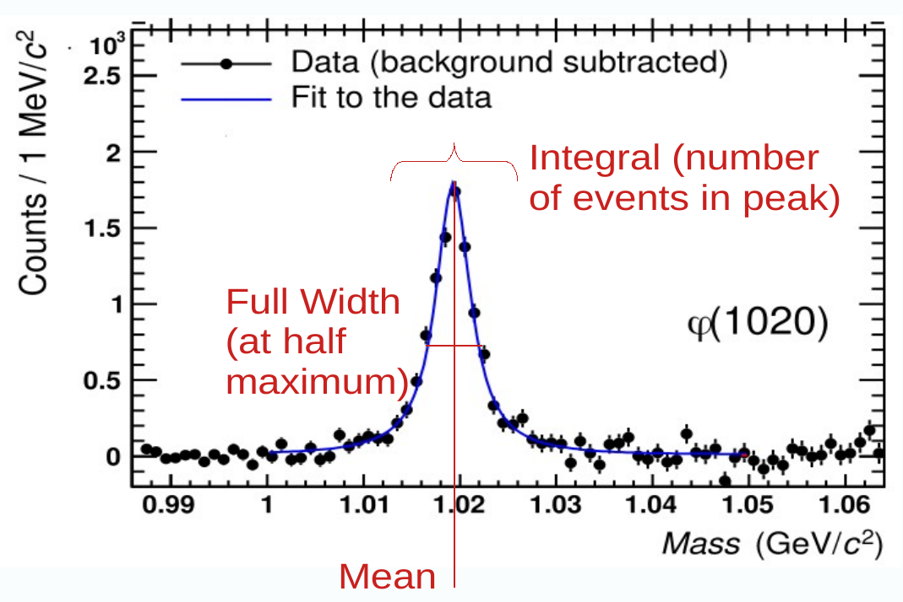
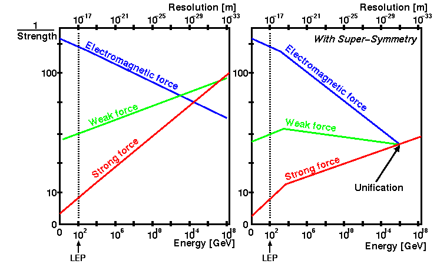
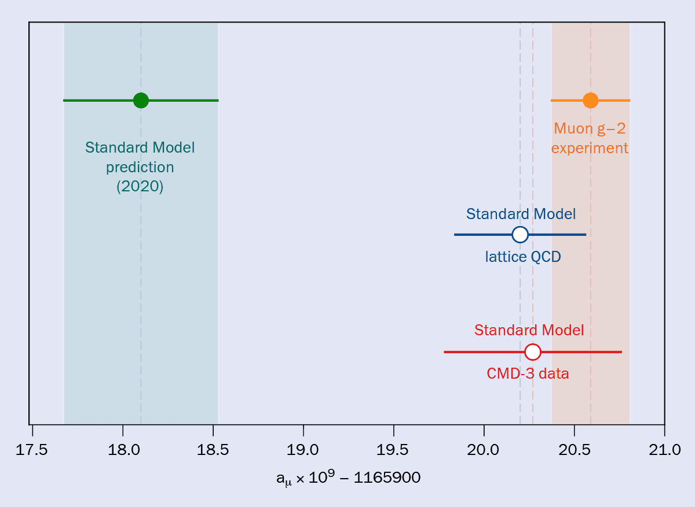

# Part 3a: Beyond the Standard Model of Particle Physics

## Searching for new phenomena

As we have seen in the previous parts of the course, scattering experiments have been crucial in uncovering the structure of [nucleons](sec_scattering) with observations on continuous changes of the cross-sections and observations of resonances within the spectrum. Let's see how we can use these principles to find new phenomena or particles.

### Change of a continuous distribution

Similar to what we have seen in elastic scattering, signs of new physics phenomena can be the deviation of the data from the predicted behaviour of the scattering. This requires a very good theoretical understand of the potential in order to predict the expected scattering behaviour.

The Standard Model gives us the instrument (the Lagrangian on the mug) to calculate how the scattering distribution might look like - as function of angle, as function of energy. This is not only the case for elastic scattering, but also for inelastic scattering, so for example for collisions of two protons in which two electrons or two muons are created ($pp \rightarrow ee$). Practically, things are slightly more involved (we have quarks inside the protons, we need to describe how those quarks from the proton don't interact, we need to model the detector response), but these are the subject of more advanced course.

In summary: we have a very good understanding of outcomes of the scattering experiments at high energies, we do know how the outgoing or final state particles of the scattering are distributed within the detector. This means we can test if we see whether we spot any difference from the expectations in energy regimes (corresponding to length scales) we have never probed before.

When we observe experimentally a different behaviour than what we theoretically expect, this means (in the absense of experimental mistakes) that the scattering potential is different than expected so there is something new or unknown contributing. This usually appears at higher energies or smaller distances (i.e. smaller scales) since both of these correspond to higher resolution.

(sec_resonance)=
### Resonances

We have seen that inelastic scattering new states can be produced. This is also called "resonant production" or "resonance particles" [{cite}`Dodd_Gripaios_2020_resonance`]. A resonance generally occurs when the internal frequency or energy of a system is matched by an external force, such that the system responds optimally or "in resonance" to the external force. A simple example is a swing that is pushed at exactly the right moment. If you time it right, the amplitude of the swing increases; if you push at the wrong time, the swing slows down.

In particle physics the equivalent is where the energy of the scattering particles is close to the mass (or more accurately $mc^2$) of an excited state or a particle, this excited state or particle is produced in resonance, i.e. scattering at these energies happen much more often. This leads to an observable resonant peak in the spectrum which is characteristic of the particle produced. This means to some extend, that in general we can learn much more from an observed peak than just from a deviation of from the prediction as demonstrated in the following figure.

 Resonance of a $\phi$ meson observed in collisions of protons with lead ions by the ALICE experiment. The $\phi$ meson is composed of a strange quark and a strange antiquark (\(\={s}\)) (adapted from {cite}`ALICE:2016sak`).

As shown in the picture we can derive the following information from a resonant peak, specifically from its:

* **Mean**: Nominal energy/mass of the state. In the figure this is 1020 GeV/$c^$.
* **Width**: The width is determined as the full width at half the maximum value (FWHM). It is related to decay time or life time of a particle via the Heisenberg uncertainty principle: $\Gamma = 2 \Delta \textrm{E} = \hbar/\Delta \textrm{t}$. For the $phi$ meson this is $1.55 \times 10^{-22}$ s (though it requires the detector resolution to be better than this width, otherwise you measure the resolution of the detector).
* **Integral / Area**: The integral or the area over the peak gives the number of observed events. Combined with the luminosity of the dataset that was recorded, this gives the cross-section to produce the particle.

## Open questions of the Standard Model

There are compelling reasons to search for physics beyond the Standard Model, because there are observations that cannot be explained by the Standard Model. Therefore we believe the Standard Model is an effective theory that covers a specific energy range and a specfic range of phenomena. We will need to *extend* the Standard Model to include new particles or interactions that could give explanations for these open questions.

### Matter-antimatter Asymmetry

Antimatter was first introduced as a concepts in 1928 when Paul Dirac attempted to describe quantum-mechanical particles moving with relativistic speeds. He noticed that in these equations, particles popped up that were essentially mirror particles of the particles he was trying to describe. These had opposite charge and were moving *backwards* in time[^1]:
[^1]: You might learn about this mathematical description later in your degree - for now, please do not worry about this.

Soon the so-called antiparticles were experimentally confirmed in 1932 by Carl Anderson who detected the positron (the electron's antiparticle) in cosmic rays (radiation from out of space).

In summary: Antimatter is build into the Standard Model and we can produce and observe it in the laboratory. From all experiments conducted so far, antimatter really behaves in a way that mirrows our everyday matter exactly[^2]:
[^2]: Experiments at CERN have investigated the properties of Anti-hydrogen and found it to have the same general properties as Hydrogen (in terms of properties of the atom)

When matter and antimatter meet, they annihilate to pure energy, e.g. an electron and a positron anihilated to a photon. When particles are created from pure energy, they are created in pairs: One particle and one antiparticle.

From observations we know, that there is not much antimatter out there: There is no (natural) anti-matter on earth in everyday interactions. Antimatter produced in radioactive decays quickly annihilates with matter and the produced photons react with matter in a way that does not prodce another antiparticle. We consistently measure less antimatter than matter being present in the solar system and the galaxy (as confirmed in the moon landing, looking at planetary probes and using satelites)[^3]. One could claim, we just live in a bubble of matter and there are large bubble of antimatter out there in the universe, however this would lead to annihilations at the border regions between these bubble. Across the board, there is no observable annihilation signal the accessible universe.

[^3]: The antimatter found in cosmic rays is produced mainly when high-energy cosmic rays smash into interstellar gas or the outer atmosphere of the Earth.

From first principles, it is therefore expected that the Big Bang (the big explosion at the start of the universe) produced matter and antimatter in equal quantities as it is natural to assume that the universe is "neutral" (e.g. has zero electrical charge). The evolution of the universe (i.e. first the formation of protons and neutrons and then of atoms) is well understood and gives some theoretical bounds on how tiny asymmetries between matter and antimatter could evolve to give us the current state of the universe.

The Standard Model does not provide a mechanism to produces the current matter-antimatter asymmetry that we observe.

### Dark Matter

In the Axion part of the course, Ed Daw discussed evidence for Dark Matter [{cite}`DMEd`].

Whilst some theorist try to solve the Dark Matter problem by modifying the theory of Gravity, these attempts have often been found to be insuffient and only to describe some aspects of the observations but falling short of describing other experimental findings. A "particle"-type explanation of Dark Matter is generally prefered by the experimental data.

The Axion is not the only Dark Matter candidate and hypothetical Dark Matter candidate particles, including some axion-like particles, can be detected at the LHC, depending on their masses.

### Generations

The Standard Model contains three generation of particles with the same properties, apart from their mass. This is quite peculiar.

Theorist David Tong describes the puzzle as follows:
*We don’t, however, understand the observed pattern of masses. More importantly, we don’t understand the vertical direction in the pattern at all. We don’t understand why there are 3 generations in the world and not, say, 17.* [{cite}`Tong:2009np`]

### Grand unification

In the Standard Model, the strengths of the [forces](forces) depends on the energy (or the resolution) at the which the force is tested. Theorists have managed to combine the electromagnetic and the weak force into the electroweak force, meaning that both electromagnetic and weak force and effective forces and that above a certain energy threshold they can be described by a unified potential. It can be shown that if we extrapolate the behaviour of the forces to higher energies, they *almost* cross in the same point, suggesting it might be able to unify all three fundamental forces into one. However, this will require some new phenomena in order to ensure the they cross in the same point.

 Evolution of the strength of the three fundamental forces of the Standard Model as function of energy. (from: {cite}`gut`)

A Grand Unified Theory (GUT) is also attractive as the Standard Model currently contains 19 free parameters that need to be fixed by experiment (and a part of the LHC experimental programme is to measure these fundamental parameters as accurately as possible). This seems slightly large for something that claims to be a fundamental theory - a GUT could help to reduce the number of needed parameters.

### Hierarchy problem

Both previous problems (Generations and Grand unification) are connected to a large difference in energy scales. These types of problems are often called Hierarchy problems physics, as there is some hierarchy of scales involved.

A similar issue arises when looking at the potential describing the Higgs Boson: Particle physics relies on quantum field theory, where masses and other observables are described using perturbation series. This is equivalent to a Taylor series expansions:

$$f(x)
= f(a)
+ f'(a)(x-a)
+ \frac{f''(a)}{2!}(x-a)^2
+ \frac{f^{(3)}(a)}{3!}(x-a)^3
+ \cdots
$$

For the Higgs boson the even and odd terms, $(x-a)^{2,4,6,...}$ and $(x-a)^{1,3,5,...}$ are very large. So, this leads to very large corrections to its mass but the even and odd terms also have different signs, so the series can still converge to a value close to the observed Higgs mass (which is close to $f(a)$ in our example. But the cancellations involved are huge – up to 17 orders of magnitude, i.e. there are terms $+ 10^{+17}$ and $+ 10^{-17}$ that cancel.

### Explanations of observed discrepancies

Finally, even if the Standard Model provides an accurate description of thousands of measurements across many order of magnitude, there are some specific measurements where the SM description fails. There are a number of such anomalies, that might be caused by either systematic errors in the measurement or the Standard Model description or be indeed a sign of the break down of the Standard Model. These observed discrapencies currently do not necessarily point towards a common explanation and as they stand are not yet enough to announce the discovery of a new phenomea. However, they are a strong reason to attempt to measure related phenomena.

One such example is the measurement of the anomalous magnetic dipole moment of the muon. The magnetic moment, also called magnetic dipole moment, is a measure of the strength of a magnetic source. The anomalous magnetic moment of fundamental particles is caused by quantum effects due to the presence of other particles. If the measured and the predicted magnetic moment of a particle do not agree, this indicated that there could be an unknown particle that causes these effects.

In 2020, the first measurements of the dedicated muon "g-2" experiment were published and showed a very large discrapency with the best Standard Model prediction at the time. The measurements at Brookhaven National Laboratory in the US had been conducted because a mild discrapency between the measurement and the prediction had been observed before and the new experiment was supposed to confirm this older measurement with a more accuracy. Since then, new calculations[^4] have become available that use updated input assumptions (from the CDM-3 data) or alternatively make use of the completely orthogonal approach of "Lattice QCD". These new calculations now agree with the measured values - the discrapency has gone away. However, there are still a number of other discrapencies that need to be resolved.

 Comparison of the Standard Model prediction for the anomalous moment of the muon (shown on the $x$-axis) with the results of the measurement (taken from {cite}`gminus2`).

[^4]: These calculations are not trivial and dedicated techniques to tackle them are needed. This is very much the topic of theoretical physics.
