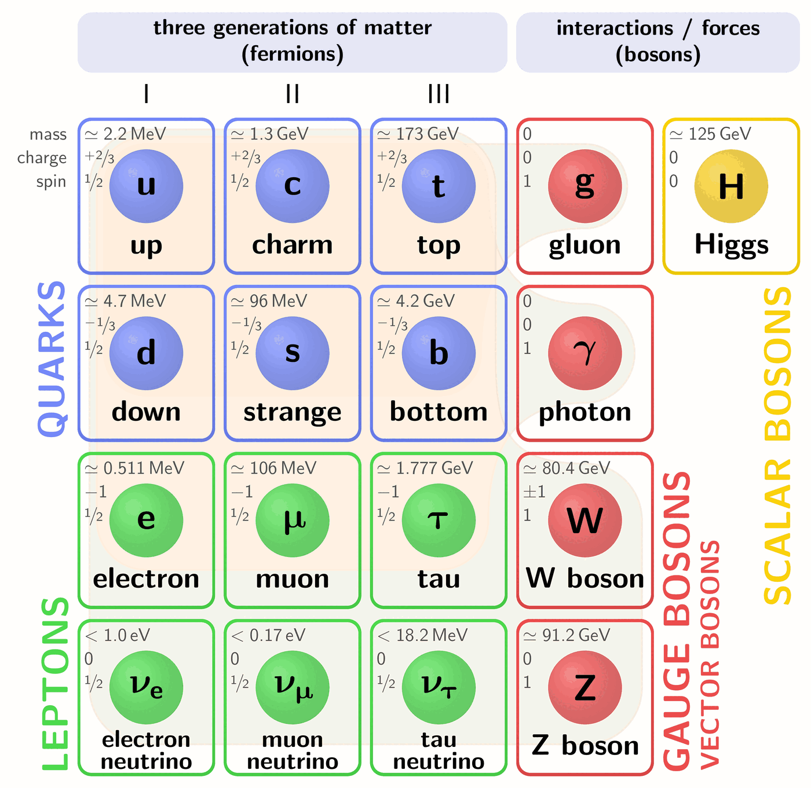

# Part 2b: The Standard Model of Particle Physics

## Particles and forces: a brief introduction to the Standard Model

### The particles of the Standard Model

There are two types of fundamental particles: Matter particles (so-called fermions) and force particles (bosons).

the full manifold of elementary particles, only few are met “in the everyday life”. These
are u and d quarks in the form of protons (udd) and neutrons (uud), electrons and,
out of interaction carriers, the photon. The reasons for that are different for different
particles. In particular, neutrino does not interact with the electromagnetic field and
is therefore very hard to detect; heavy particles are unstable and decay to lighter ones;
strongly interacting quarks and gluons are confined in hadrons. The full manyfold of SM
particles reveal themselves either in complicated dedicated experiments, or indirectly
by their effect seen in astrophysical observations

$$f(x)
= f(a)
+ f'(a)(x-a)
+ \frac{f''(a)}{2!}(x-a)^2
+ \frac{f^{(3)}(a)}{3!}(x-a)^3
+ \cdots
$$

#### Fermions: matter particles

The matter particles can be divided again into two classes: leptons and quarks. Leptons are either charged (electron, muon or tau) or neutral (all neutrinos). Quarks have non-integer charge of +2/3 or -1/3.  Every matter particle has an anti-particle with the same mass but opposite charge. This means, there are 24 matter particles within the Standard Model. Fermions can be grouped into so-called generations with the particles in the larger generations having the same properties (such as charge) but a larger mass. For example, the electron, muons and taus have the same charge, interact with the same forces and the same coupling strength but whilst the electron mass is 0.511 MeV, the muon mass is 103 MeV and the tau has a mass of 1777 MeV. 

*Table of Fermions*

|  Fermion   | Charge | Generation 1 | Generation 2 | Generation 3 |
|------------|--------|--------------|--------------|--------------|
| Leptons    |   -1    | electron     |  muon        |  tau            |
| Leptons    |   0    | electron-neutrino| muon-neutrino   | tau-neutrino |
| Quarks     |  +2/3  |     up       | charm        |     top      |
| Quarks     |  -1/3  |     down     | strange      |     bottom   |

#### Bosons: force carriers

In the Standard Model, the action of forces is explained as the result of exchanges of force particles, which transfer energy  and momentum (and sometimes other properties such as charge) between the interacting particles.  The Standard Model describes three fundamental forces, each of which has its own exchange particle or particles.

*Table of Bosons:*

| Boson      |  Charge       | Mass         | Force         |
|------------|---------------|---------------|----------------|
| Photon     |    0          |   0          | electromagnetic |
| W Boson    |   +/-1        |   80.4 GeV   | weak (charge current) |
| Z Boson    |    0          |   91.2 GeV   | weak (neutral current) |
| gluon      |    0          |   0          | strong force |
| Higgs      |    0          |   125 GeV    | gives rise to masses of other particles (not a force strictly speaking) |

|   Force    | Particle | Strength   | Range         |Affects         |
|------------|----------|--------------|---------------|--------------|
| Strong     |  gluon   |        1     |   10$^{-15}$ m  | quarks     | 
| electromagnetic   | photon   |   1/137  |    infinite  | charged particles |
| weak       |  W,Z Bosons  | 10$^{-6}$  |   10$^{-18}$ m  |  everything  |

The following pictures summarized the Standard Model, giving the mass, charge and the spin of each particle. The spin of a particle is a quantum mechanical property that behaves like an intrinsic angular momentum. Particles that have half-integer spin are called fermions and obey the Pauli exclusion principle (no two fermions can have the same quantum numbers in the same place at the same time); particles that have integer spin are bosons and do not obey the exclusion principle (for example, you can have any number of identical photons). 

It also highlights different groupings of particles (in the lecture slides, these are given separately), namely:

- fermions
- quarks
- leptons
- 1st generation
- 2nd generation
- 3rd generation
- all bosons
- Force carriers: Bosons with Spin 1
- particles participating in the strong interaction
- particles participating in the electromagnetic interacton
- particles participating in the weak interacton
- Higgs Boson that gives mass to all fermions and heavy weak bosons
- all particles

(sec_quarks)=
#### Quarks

No interaction in the Standard Model can convert a quark into a lepton or vice versa. There exist conservation laws describing this fact.

Baryon number is defined as the total number of baryons minus the total number of anti-baryons. Similarly, the number of leptons is conserved: Each lepton genera­tion has its own conserved lepton number.

#### Open questions of the Standard Model

