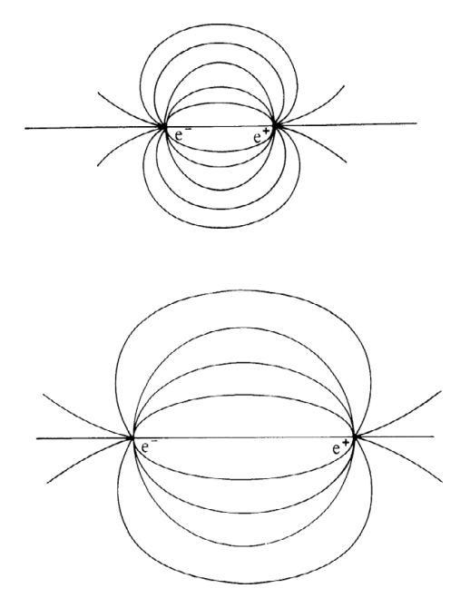
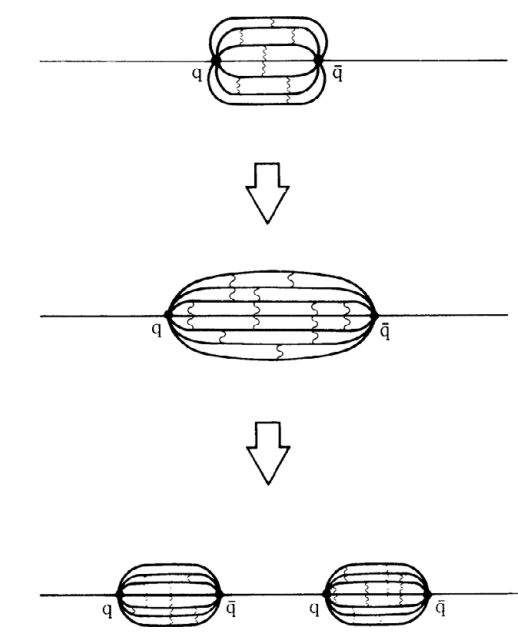

# Part 2b: The Standard Model of Particle Physics

## Particles and forces: a brief introduction to the Standard Model

The "Standard Model" is a slightly plain name for what it actually describes: The "Standard Model" is one of the single most successful theories of nature, describing the fundamental interactions and particles within the universe over a larger range of energy and length scales. It has been probed with high precision in thousands of of measurements and found to be accurate.

It can be summarized into one single formula (please do **not** think you will need to learn it by heart):
\begin{align*}
\mathcal{L} &= - \frac{1}{4} F_{\mu \nu} F^{\mu \nu} \\
    &\phantom{{}=}+ i \bar{\psi} \cancel{D} \psi + h.c. \\
    &\phantom{{}=}+ \bar{\psi}_i y_{ij} \psi_j \phi + h.c. \\
    &\phantom{{}=}+ |D_\mu \phi|^2 - V(\phi)
\end{align*}

This is a so-called Lagrangian, a function which summarizes the dynamics of the entire system. Lagrangian mechanics is a different mathematical way to analyse the movement or the dynamics of particles compared to Newtonian mechanics. So in other words, this Lagrangian is effectively a different way to write down a potential. As we have seen previously, a potential can be characterized by observing the scattering of particles off that potential and this is how the Standard Model was "built".

For the purpose of this course, it is fully sufficient to consider a different description of the Standard Model - not its mathematical formulation, but the actual **content of the Standard Model** and its underlying order principle. Before looking at the dry facts of the table of the Standard Model, let's have a look at how Theorist David Tong describes the make-up of the SM (text slightly adapted from {cite}`Tong:2009np`):

*From this perspective, the Standard Model might look like a periodic table look like to a chemist, placing elements in groups with similar behaviour:  Those elements on the left of the table go fizz when you put them in water. Those on the right don’t. The periodic system is a neat way to systematically arrange the structure of matter. Fundamentally, you can replace the periodic system with a much simpler picture: All elements consist of just three particles: The Electron, the Proton and the Neutron.*

*Sadly physicists had less than 100 days to enjoy this simple picture! The neutron was the last of the three particles to be discovered. That happened in May 1932. In August of the same year, anti-matter was found and subsequent discoveries then came thick and fast. We now know that the sub-atomic world contains many riches beyond the three obvious particles that can be found in atoms and they can be arrange in the "table" of the Standard Model (see the Figure below).*

*Historically, after the discovery of anti-matter, another neutral particle called the neutrino was discovered. This is not one of
the building blocks from which we're made but has an important role to play in the universe. The neutrino carries no electric charge and is much lighter than all the other particles. It is usually introduced with the adjective "elusive": it barely interacts and can travel through a lightyear of lead with only a 50% chance of hitting anything. Not long after, first signs of proton and neutron substructure and a whole zoo of other particles were discovered, even if it took much longer to understand the underlying principles. The particles making up the neutron and proton and the other particles (hadrons) are $u$ and $d$ quarks in the form of protons ($udd$) and neutrons ($uud$).*

*So at this stage, a world with just four particles could be imagined: Electrons, neutrinos and up- and down quarks.*

*One might have thought this was a good place to stop. However, at this stage, something strange happens. For reasons that we don’t understand, Nature chose to take this pattern of four particles and repeat it twice over. The total number of particles of this type that we know about in the Universe isn’t 4, but 12.*

*Each column of the below "Table of Fermions" is called a generation. Hence, each generation consists of an electron-like particle, two quarks, and a neutrino. The statement that each generation behaves the same means that, among other things, the electric charges of all electron-like particles in the first row are −1; the electric charges of all quarks in the third column are +2/3 and all those in the fourth column are -1/3. All neutrinos (second column) are electrically neutral.*

## The particles of the Standard Model

There are two types of fundamental particles: Matter particles (so-called fermions) and force particles (bosons).

Of the full manifold of elementary particles, only few can be met in everyday life. These are mainly those of the first generation: up and down quarks in the form of protons and neutrons, electrons and, out of the force particles, the photon. The reasons for that are different for different particles: In particular, the neutrino does not interact with the electromagnetic field and is therefore very hard to detect; heavy particles are unstable and decay to lighter ones; strongly interacting quarks and gluons are confined in hadrons. The full manifold of SM particles reveal themselves mainly in scattering experiments, or indirectly by their effect seen in astrophysical observations.

### Fermions: matter particles

The matter particles can be divided again into two classes: leptons and quarks. Leptons are either charged (electron, muon or tau) or neutral (all neutrinos). Quarks have non-integer charge of +2/3 or -1/3.  Every matter particle has an anti-particle with the same mass but opposite charge. This means, there are 24 different matter particles within the Standard Model[^1]:
[^1]: Tong counts 12 (see above) by not counting the anti-particles as "different" - This already tells you there is some ambiguity in how you count "different".

Fermions can be grouped into so-called generations with the particles in the larger generations having the same properties (such as charge and some others you will still learn about) but a larger mass. For example, the electron, muon and tau have the same charge, interact with the same forces and the same coupling strength but whilst the electron mass is 0.511 MeV, the muon mass is 103 MeV and the tau has a mass of 1777 MeV.

*Table of Fermions*

|  Fermion   | Charge | Generation 1 | Generation 2 | Generation 3 |
|------------|--------|--------------|--------------|--------------|
| Leptons    |   -1    | electron     |  muon        |  tau            |
| Leptons    |   0    | electron-neutrino| muon-neutrino   | tau-neutrino |
| Quarks     |  +2/3  |     up       | charm        |     top      |
| Quarks     |  -1/3  |     down     | strange      |     bottom   |

### Bosons: force carriers

In the Standard Model, the action of forces is explained as the result of the exchange of force particles, which transfer energy and momentum (and sometimes other properties such as charge) between the interacting particles.  The Standard Model describes three fundamental forces, each of which has its own exchange particle(s).


*Table of Forces:*
(forces)=
|   Force    | Particle | Strength   | Range         |Affects         |
|------------|----------|--------------|---------------|--------------|
| Strong     |  gluon   |        1     |   10$^{-15}$ m  | quarks     |
| electromagnetic   | photon   |   1/137  |    infinite  | charged particles |
| weak       |  W,Z Bosons  | 10$^{-6}$  |   10$^{-18}$ m  |  everything  |
| gravitational       |  W,Z Bosons  | 10$^{-6}$  |   10$^{-18}$ m  |  everything  |

Gravity is not included in this table as there is no theory of the gravitational force that is compatible with the particle picture and that has been experimentally confirmed.

Each of these forces is associated or exchanged via a specific particle, a so-called boson.

*Table of Bosons:*

| Boson      |  Charge       | Mass         | Force         |
|------------|---------------|---------------|----------------|
| Photon     |    0          |   0          | electromagnetic |
| W Boson    |   +/-1        |   80.4 GeV   | weak (charge current) |
| Z Boson    |    0          |   91.2 GeV   | weak (neutral current) |
| gluon      |    0          |   0          | strong force |
| Higgs Boson      |    0          |   125 GeV    | gives rise to masses of other particles |

### Electromagnetic versus Strong force

The Geiger-Marsden scattering experiment probes an electromagnetic potential and - with increasing resolution (i.e. smaller wavelength) also the strong force. This was evidenced by the change of the scattering cross-section for higher energies and larger angles. It is interesting to compare the electromagnetic and strong force in order to understand what is typical of a force (and also to see where forces and their potentials can differ). The weak force is more complicated in its structure, which is why we are not discussing it in detail.

#### The EM force

The EM force is mediated by a neutral force carrier, the photon. It can be attrative or repulsive depending on the charges invovled - opposite charges attract each other and like charges repulse each other. There are only two posible values for the charge: positive and negative. Because the force carrier of the electromagnetic force, the photon, does not have mass, the electromagnetic force has infinite range, though it weakens significantly with distance ($\sim 1/r^2$).

#### The strong force

The strong force is mediated by the gluon. The charge of the strong force is called "colour", because there are three different basic charges: red, green and blue after the primary colors of light. Because of this analogy, the theory of the strong force and how it interacts is also called Quantum chromodynamics. Aside of the three basic charges, there exist also the respective anti-charges: anti-red, anti-green and anti-blue. Unlike the photon, the gluon does carry colour charge - namely both a colour and an anti-colour, e.g. (R\bar{G}). Quarks carry just one colour (or anti-colour) but only exit in colourless bound states of (q(R) + \bar{q}(\bar{R})) (anti-quark-quark pairs, mesons) or (q(R) + q(G) + q(B)) (baryons). The strong interaction is so strong, that quarks do not exist as free states outside these solid particles. The colour structure of the strong force was mainly discovered in scattering experiments in the 50s and 60s when a large number of [resonances](resonances) of these mesons and baryons were produced in inelastic scattering and investigated. Some more optional background information can be found in {cite}`Dodd_Gripaios_2020_color`.

The strong force is peculiar also for another reason: As the gluons carry charge themselves, this *also* means that - again unlike the photon - they can interact with themselves. A pair of gluons can exchange energy and momentum via the exchange of a third gluon. Because the gluons interact with each other, the strong force grows with energy ($\sim r$) despite gluons being massless. Think of magnetic field lines that connect the poles - the further you pull the poles apart, the more spaced out the magnetic field lines are. If you pull two quarks apart, the field lines stay close together - due to the self-interaction and attraction of the gluons. As the energy grows, the field between the quarks can grow so strong that it breaks down to create an additional pair of quarks out of the vacuum (perhaps one could think of the sparking of a very strong electromagnetic field, though this in fact a completely different phenomena).

            $\,\,\,\,\,\,\,\,\,\,\,\,\,\,\,$         

a) Field lines for an electrical or magnetic field: they spread as the charges move apart. (b) Field lines of the strong force stay close (note the little gluons exchanged between them) and can get so energetic that new quarks are created (taken from {cite}`Dodd_Gripaios_2020_color`)


```{admonition} Calculation

<b>The strong force at a distance</b>

Two quarks at a distance of 1.0 fm are attracting each other with a force of magnitude 2.0 $\times 10^4$ N. Let's estimate the magnitude of the force at a distance of 9.0 fm.

The strong force is proportional to $r$.

Therefore the force at a distance of 9 fm must be 9 times larger than the force at the distance 1 fm ($9\div 1$ fm).

$$
F (r=9.0 \textrm{fm}) = 2.0 \times 9 \times 10^4 \textrm{N} = 18 \times 10^4 \textrm{N}
$$

```

### The Higgs Boson (optional)

The Higgs Boson is included in the table as it is a boson - however it does not technically transmit a force. The Higgs Boson is responsible for the masses of the fundamental particles. In fact, this is one of the reasons why the Higgs Boson was considered a very attractive theoretical proposal even before it was experimentally confirmed or found.

*But why is - or was - the mass of fundamental particles a problem?* The reason is simple: Mass as we know it - mass of atoms or molecules - is created through binding energy. Some of you might have learned in A levels that there is the mass difference between the total mass of a nucleus and the sum of the masses of its constituent nucleons. This difference in mass is known as the mass defect. The decay of a heavier composite particle into it's constituents therefore releases energy (converted via $E=mc^2$), an effect used in nuclear fission used in reactors. In this case the mass is created through binding energy, basically through the fact that the particle is composite. However for fundamental particles this cannot be the mechanism to create - they are *not* composite particles! Instead, the Higgs mechanism is at play: Particles couple or interact with the Higgs Boson and through this interaction slow down which is interpreted or measured as inertial mass. The strength of the interaction with the Higgs Boson is proportional to the masses of the fundamental particles - so it does not really explain the difference masses (or generations), it just generally gives an explanation of the mechanism of how mass is generated for fundamental particles.

## Short summary of the Standard Model

The following figure summarized the Standard Model, giving the mass, charge and the spin of each particle. The spin of a particle is a quantum mechanical property that behaves like an intrinsic angular momentum. Particles that have half-integer spin are called fermions and obey the Pauli exclusion principle (no two fermions can have the same quantum numbers in the same place at the same time); particles that have integer spin are bosons and do not obey the exclusion principle (for example, you can have any number of identical photons).[^2]:
[^2]: You do not need to learn masses, charges or spin for the exam, but it's good to be aware they exist.

It also highlights different groupings of particles (in the lecture slides, these are given separately), namely:

- fermions
- quarks
- leptons
- 1st generation
- 2nd generation
- 3rd generation
- all bosons
- Force carriers: Bosons with Spin 1
- particles participating in the strong interaction
- particles participating in the electromagnetic interacton
- particles participating in the weak interacton
- Higgs Boson that gives mass to all fermions and heavy weak bosons
- all particles


 Particle Content of the Standard Model (from {cite}`SMplot`)

